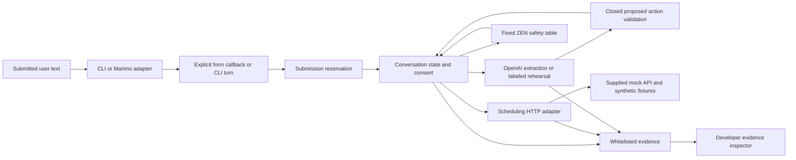

# As-built architecture

Updated: 2026-10-09. Reviewed product revision: `71f8e601e5666f15e4d3b3874e8d59537a089b35`; original product baseline; persona follow-on source is reviewed against committed adoption base c19680e plus the subsequent tested parser/support-summary delta. Controlled IAB repeated submission and responsive layout passed. Fresh Mac ARM/Linux installation and 90-test qualification are linked below.

## Runtime boundaries

The application uses one deterministic Python conversation core with two thin entry points. [CLI](../../../src/appointment_assistant/__main__.py) and [Marimo application](../../../apps/lab.py) create the same [Session](../../../src/appointment_assistant/conversation.py), scheduling adapter and interpreter. Marimo's explicit `text_area.form` callback delegates through [FormAdapter](../../../src/appointment_assistant/ui_adapter.py), which uses the cached `ChatAdapter` receipt boundary internally. Transcript/evidence inspection only reads snapshots. The form replaces the initial `mo.ui.chat` adapter after an upstream chat metadata defect. Stable form cells and explicit callbacks passed repeated-submit browser qualification.

[SchedulingAPI](../../../src/appointment_assistant/scheduling.py) now implements the diagrammed HTTP boundary. It validates inputs and returned envelopes/records, checks requested attributes against results, bounds response size and disables redirects. Patient appointment routes use a redacted evidence template. It preserves the diagnostic scenario header, including on handoffs. Only validated HTTP 201 results confirm writes; unreadable/mismatched POST results are unknown, with no retry. The [supplied reference server](../../../vendor/reference-api/mock-api/server.py), [OpenAPI contract](../../../vendor/reference-api/openapi/scheduling-api.yaml) and [synthetic fixtures](../../../vendor/reference-api/data/README.md) are copied unchanged. No scheduling backend or database was invented. Every candidate and integration fixture must own separate in-memory reference-server state.

## Interpretation and authority

[OpenAIInterpreter](../../../src/appointment_assistant/openai_interpreter.py) sends bounded text plus a projected context to the Responses API with `store:false`, strict JSON schema and a finite timeout. Its default model is `gpt-5.4-mini`, configurable by CLI/environment. It rejects incomplete/refused/malformed/duplicate structured output and validates the proposal locally. Credentials come from process environment; no Bitwarden runtime dependency exists. [RehearsalInterpreter](../../../src/appointment_assistant/interpretation.py) provides explicitly labeled deterministic simulation, never silent fallback from live errors.

[ProposedAction and service records](../../../src/appointment_assistant/models.py) and [extraction validation](../../../src/appointment_assistant/interpretation.py) separate model suggestions from authoritative service facts. The model proposes intent, nullable field patches and displayed option ordinal; it has no authoritative patient/slot ID or consent field.

`Session` owns private identifiers, preferences, returned slots, revision and proposal. It verifies phone plus date of birth through patient search and privately filters duplicate returned records by caller-supplied ZIP. Provider discovery bypasses patient identification. API-derived slots are numbered before selection; selection creates a patient/slot/revision proposal but does not book. Only an entire current `yes` or `confirm` after the unchanged summary may dispatch booking. Corrections invalidate the proposal before effect checks. A known completed booking is reused for repeated confirmation. Unknown booking and handoff latches prevent replay/reset from implying failure; human reconciliation remains required. Identity corrections clear verification before medical/human/unsupported handoff so a prior patient cannot be attached after corrected identity. Provider lookup asks focused specialty/location follow-ups. Before displaying slots, the core validates provider ID, specialty and location joins against returned providers.

## Meaningful rule evaluation

[PolicyGate](../../../src/appointment_assistant/policy.py) invokes actual ZEN 2.1.2 against [rules/safety.json](../../../rules/safety.json) before proposed effects. The first-hit table allows public providers/patient search/safe handoff, requires verified identity for patient reads, and requires verified identity, current API slot, current consent and no unknown prior write for booking. Medical/unsupported operations deny. Facts are closed booleans plus an operation enum, without identifiers or free text. Missing document, engine error, malformed facts or contradictory result denies. This is a local scheduling guard, not medical eligibility or production authorization. Code independently retains consent and transaction checks.

## Effects, replay and evidence

[SubmissionGate](../../../src/appointment_assistant/submission.py) reserves each positive generation under a lock before invoking work. Duplicate in-flight entries return a pending receipt; completed/unknown results are cached. Exceptions leave a sanitized failed receipt and cannot rerun that generation. The bounded receipt store fails closed when full rather than pruning reservations. Session locking serializes distinct turns. These are process/session safeguards, not durable distributed idempotency or permission to retry unknown POSTs.

[Evidence](../../../src/appointment_assistant/events.py) constructs events from closed category/field/value sets. It records random local session token, sequence, timestamp, state/intent/guard/API metadata and latency. It accepts neither raw prompts/transcripts/bodies/queries nor patient/provider/slot IDs or exception text. Buffer and sink snapshots are copies; sink failure cannot turn a completed effect into a retry. The inspector renders this safe projection, separately from verified user-visible scheduling facts.

The [source notices](../../../THIRD-PARTY-NOTICES.md) pin the public Reasoning Lab event/submission inspirations and retain MIT attribution. [UI asset provenance](../ui-assets.md) identifies the approved internal-audience logo/theme; no whole SDK or public-site CSS is imported.

## Qualification and limits

The policy/evidence/submission owner verified 15 boundary tests against actual ZEN. The scheduling adapter has nine focused tests covering supplied-server roundtrip, date-name translation, error/unknown handling and diagnostic failure isolation. Current CLI/demo and form boundary tests are present, including private fixture resets and identical form submissions. All 24 conversation tests passed when run from the candidate root. This document does not claim a final passing combined suite. The integrating owner owns the authoritative final combined run, supplied-service success/failure demonstrations, live multi-turn application evidence, clean-clone checks and browser repeated-submit qualification.

State is memory-only. Fixture verification is not production authentication. Dates use the service's fixed offset, not DST-aware scheduling. A queued mock handoff does not establish human contact. Reschedule/cancel, durable replay protection, production compliance and video recording are not established here. See [code walkthrough](code-walkthrough.md), [native tasks](../../../specs/001-appointment-assistant/tasks.md), and [feature specification](../../../specs/001-appointment-assistant/spec.md).

Persona follow-on: schema-valid out-of-range ordinals reach deterministic current-choice validation, preserving visible options and identity without effects. Session builds fixed categorical support summaries separating known facts, missing information and persistent booking outcome; no identity values, IDs, dates or raw clinical/request text cross that summary boundary. [Persona choice integration tests](../../../tests/test_persona_choices.py) and [conversation tests](../../../tests/test_conversation.py) cover the repaired behavior; [live evidence](../live-qualification.md) records actual keyboard/UI checks.

Booking outcomes are bound to the attempt revision; a corrected request labels a prior outcome as an earlier attempt. Unknown effects still require reconciliation regardless of revision.
